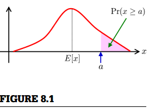

###8.2 概率不等式

在本节中，介绍了基于期望和方差的概率不等式。
####8.2.1 马尔可夫不等式和切比雪夫不等式
对于具有期望  的非负随机变量  ,  
  
该式对任意正标量  成立（如图8.1）。这就是马尔可夫不等式，让我们仅从期望就可得到概率的上限。由于  ,类似地可以得到概率的下限：  
  
马尔可夫不等式可以由如下函数来证明  
  
对  ，满足  :  
  
对于任意非负的单调递增函数 ，马尔可夫不等式可以推广为  
  
在公式(8.2)的基础上，设 ,,则  
  
这被称为切比雪夫不等式。由于  的最小化，公式(8.3)的右侧产生更紧密的上界。  

