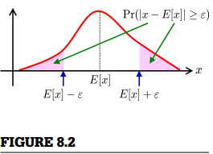

### 8.2.2 Cantelli不等式和切比雪夫不等式

马尔可夫不等式基于期望  来求概率上限。在这里，我们介绍在基于期望  外，利用方差  来求概率上限。  

当随机变量  具有期望  和方差  ,并有通用不等式如下(由  可得)  
  
由马尔可夫不等式（8.1）可得，对于正标量  ,  
  
这被称为Cantelli不等式或单边切比雪夫不等式。 类似地，以下不等式也成立：  

此外，由马尔可夫不等式（8.1）可得出
  
这被称为切比雪夫不等式（如图8.2）。马尔可夫不等式只能约束单侧概率，而切比雪夫不等式允许我们约束双侧概率。 可以类似地获得下限：  
  
  
切比雪夫不等式可以扩展到任意区间  ：  
  
这可以通过马尔可夫不等式来证明：  
  
需要注意，上述不等式缩小到原始的切比雪夫不等式（8.5），通过设  
 和  .
