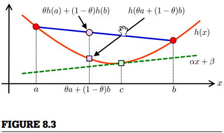

##8.3 期望不等式

在本节中，介绍期望的不等式。

###8.3.1 琴生不等式
对于所有的  和  ，实函数  满足  

则被称为*凸函数*（如图8.3）。  

如果  是凸的，对于任意  ，存在切线

它和  在  处相切，并处于  下方 (如图8.3) ：

 ,并对所有的  满足 

设 

这被称为*琴生不等式*。实际上，由于  是非线性变换，计算它的期望  通常是比较困难的。另一方面，由于它关于期望只是一个非线性变换，计算  会很直接。因此，琴生不等式让我们知道了  的一个下限，即便它很难计算。

琴生不等式可以拓展到多维凸函数  ：

