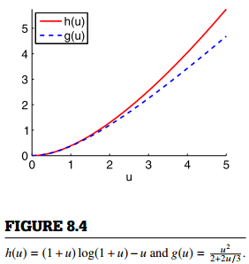

### 8.4.3 Bennett 不等式

对于随机变量  ，令  ， ，应用 Bennett 公式可得，  

 ，  

代入到切尔诺夫不等式  得到 :   

 。  

设  ，使上述上限缩小至 :  

 ，  

其中  。  

这被称为 *Bennett 不等式* 。  

  

对于  ，以下不等式成立 (如图8.4)：  

 。  

进一步计算上限的 Bennett 不等式实际上给出了在  节中提到的伯恩斯坦不等式的证明。因此，虽然 Bennett 不等式比伯恩斯坦不等式稍微复杂一点，但它得到了一个更为紧密的上限。
