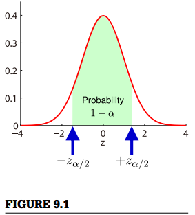

## 9.3 区间估计

由于估计量  是样本  的函数，它的值取决于样本的实现。因此，如果既提供点估计值又提供其估计的可靠性，所进行的估计将更加的有效。  

包含最小概率为  的估计量  的区间被称为具有 *置信水平*   的 *置信区间* 。 在本节中，介绍了估计置信区间的方法。

### 9.3.1 基于正态样本期望的区间估计

对于具有正态分布  的一维样本  ，如果期望  由样本平均值估计，  

 ，  

标准化估计量  

   

服从标准正态分布  。由此，可以得到  的置信水平为  的置信区间：  

 ，  

其中  对应于标准正态密度的中间  的概率（如图9.1）。然而，为了在实际中计算置信区间，我们需要知道标准偏差  。   

  

当  未知时，从样本中估计  

 。  

在这种情况下，用  标准化的估计量，  

 ，  

服从自由度为  的  分布（  节）。因此，使用  的标准化有时被称为 *学生化* 。  

  密度的中间  概率（见  节）给出了置信水平为  的置信区间：  
 
  ，  
 
 其中  对应于具有  个自由度的  密度的中间  概率（如图9.1）。如图4.9所示，在函数末尾  密度比正态密度大。

